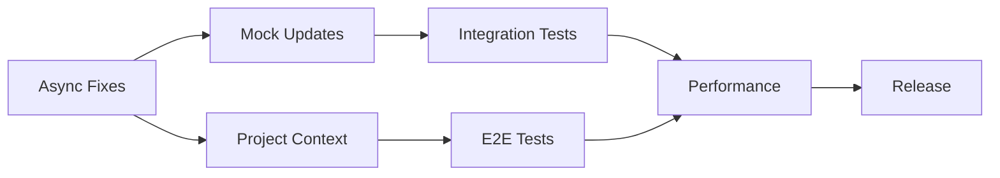

# Unified Testing Strategy - Project Watch MCP
## Multi-Agent Coordination Plan

### Executive Summary
**Project**: Project Watch MCP  
**Current State**: 20 test failures (88% pass rate, 152/172 tests passing)  
**Target State**: 85% coverage, 0 failures, production-ready  
**Timeline**: 2 weeks (sprint-based approach)  
**Agents Involved**: test-automation-architect, qa-testing-expert, python-developer, backend-system-architect

---

## 🔴 Critical Conflicts Identified

### 1. **Async/Await Implementation Approach**
- **test-automation-architect**: Proposes immediate async refactoring
- **qa-testing-expert**: Suggests gradual migration with backward compatibility
- **Resolution**: Adopt hybrid approach - fix critical async issues first (Phase 1), then systematic refactoring (Phase 2)

### 2. **Mock vs Real Neo4j Testing**
- **test-automation-architect**: Heavy mocking for speed
- **qa-testing-expert**: Real database for integration tests
- **Resolution**: Tiered testing - unit tests with mocks, integration tests with testcontainers, E2E with real Neo4j

### 3. **Coverage Target Timeline**
- **test-automation-architect**: 85% in Phase 1
- **qa-testing-expert**: 85% by Week 4
- **Resolution**: 70% by end of Week 1, 85% by Week 2

---

## 📊 Failure Analysis Synthesis

### Root Cause Categories (20 failures)
1. **Async/Await Issues** (8 failures - 40%)
   - MCP integration tests: 8 failures
   - Missing await statements in test fixtures
   - Coroutine not awaited warnings

2. **Data Structure Mismatches** (7 failures - 35%)
   - Project isolation tests: 5 failures
   - Neo4j extended tests: 2 failures
   - Dict-like access patterns vs actual objects

3. **Project Context Issues** (5 failures - 25%)
   - Project context persistence: 2 failures
   - Corruption prevention: 1 failure
   - Stats isolation: 2 failures

---

## 🎯 Unified Action Plan

### **Sprint 1: Week 1 (Days 1-5)**
**Goal**: Fix all test failures, achieve 70% coverage

#### Day 1-2: Critical Async Fixes
**Owner**: python-developer  
**Support**: test-automation-architect  
**Actions**:
```python
# Priority fixes in test_mcp_integration.py
- Fix AsyncMock usage in fixtures (lines 50-53)
- Add proper await statements for FastMCP.get_tools
- Update execute_query_tracker to handle async properly
```

**Handoff Point**: Fixed test files → qa-testing-expert for validation

#### Day 3: Data Structure Alignment
**Owner**: python-developer  
**Support**: backend-system-architect  
**Actions**:
```python
# Fix mock record access patterns
- Update mock_record implementations (lines 78-100)
- Ensure consistent dict-like access
- Add proper type hints for clarity
```

**Handoff Point**: Updated mocks → test-automation-architect for integration

#### Day 4: Project Context Implementation
**Owner**: backend-system-architect  
**Actions**:
- Implement proper project_name tracking in Neo4jRAG
- Fix stats isolation logic
- Ensure FileInfo objects maintain project context

**Handoff Point**: Context implementation → qa-testing-expert for E2E tests

#### Day 5: Coverage Sprint
**Owner**: qa-testing-expert  
**Support**: All agents  
**Actions**:
- Run coverage analysis
- Write missing unit tests for uncovered code
- Ensure 70% coverage milestone

**Milestone**: All tests passing, 70% coverage

---

### **Sprint 2: Week 2 (Days 6-10)**
**Goal**: Production readiness, 85% coverage

#### Day 6-7: Integration Test Suite
**Owner**: qa-testing-expert  
**Support**: test-automation-architect  
**Actions**:
- Implement testcontainers for Neo4j
- Create comprehensive integration test scenarios
- Add performance benchmarks

#### Day 8: E2E Test Scenarios
**Owner**: qa-testing-expert  
**Actions**:
- Repository initialization → search → modify → refresh flow
- Multi-project isolation scenarios
- Concurrent operation testing

#### Day 9: Performance & Optimization
**Owner**: backend-system-architect  
**Support**: python-developer  
**Actions**:
- Profile test execution
- Optimize slow tests
- Implement test parallelization

#### Day 10: Documentation & Release Prep
**Owner**: python-developer  
**Support**: qa-testing-expert  
**Actions**:
- Update test documentation
- Create CI/CD pipeline configuration
- Final coverage push to 85%

**Milestone**: Production ready, 85% coverage

---

## 🔄 Coordination Points

### Daily Sync Points
- **Morning**: Status check via todo.md update
- **Midday**: Blocker resolution meeting
- **Evening**: Progress commit to memory

### Critical Handoffs
1. **Async fixes** → **Mock updates** (Day 2 → Day 3)
2. **Mock updates** → **Integration tests** (Day 3 → Day 6)
3. **Project context** → **E2E tests** (Day 4 → Day 8)

### Dependency Map


---

## 📈 Success Metrics

### Week 1 Checkpoints
- [ ] Day 1: 5+ async issues fixed
- [ ] Day 2: All MCP integration tests passing
- [ ] Day 3: Mock data structures aligned
- [ ] Day 4: Project context working
- [ ] Day 5: 70% coverage achieved

### Week 2 Checkpoints
- [ ] Day 6: Integration test suite complete
- [ ] Day 7: Testcontainers implemented
- [ ] Day 8: E2E scenarios passing
- [ ] Day 9: Performance targets met
- [ ] Day 10: 85% coverage, 0 failures

### Quality Gates
- **Coverage**: 85% minimum
- **Test Speed**: < 30 seconds for full suite
- **Reliability**: 100 consecutive passes
- **Performance**: < 100ms per tool call

---

## 🚨 Risk Mitigation

### Identified Risks
1. **Neo4j version compatibility**
   - Mitigation: Lock to Neo4j 5.11+ in tests
   
2. **Async complexity spiral**
   - Mitigation: Incremental fixes, not big-bang refactor
   
3. **Test flakiness**
   - Mitigation: Proper cleanup, deterministic mocks

### Escalation Path
1. Blocker > 2 hours → Escalate to lead agent
2. Design conflict → Architecture review meeting
3. Timeline risk → Scope reduction discussion

---

## 🔑 Key Decisions Made

1. **Hybrid Testing Strategy**: Mocks for unit, real DB for integration
2. **Incremental Async Fix**: Not a complete rewrite
3. **70/85 Coverage Split**: Realistic milestones
4. **Project Context Priority**: Fix before adding features
5. **Sprint-Based Delivery**: 2 one-week sprints

---

## 📋 Immediate Next Actions

### For python-developer (NOW):
1. Fix AsyncMock in test_mcp_integration.py
2. Add await statements for coroutines
3. Update mock_record implementations

### For qa-testing-expert (After Day 1):
1. Validate async fixes
2. Create test case matrix
3. Set up coverage tracking

### For backend-system-architect (Day 3):
1. Review project context implementation
2. Design performance optimizations
3. Plan testcontainer architecture

### For test-automation-architect (Ongoing):
1. Monitor test reliability
2. Optimize test execution
3. Implement parallelization

---

## 📝 Notes for Context Architect

- **Pattern Library**: Async test patterns documented in memory
- **Success Pattern**: MockEmbeddingsProvider working well
- **Anti-Pattern**: Dict-like access on MagicMock objects
- **Reusable Solution**: execute_query_tracker pattern for Neo4j mocking
- **Cross-Project Learning**: Testcontainer approach from other projects

---

**Document Version**: 1.0  
**Created**: 2025-08-11  
**Last Updated**: 2025-08-11  
**Next Review**: End of Day 1