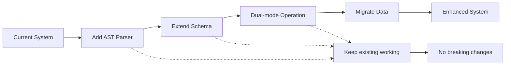

# Current vs Proposed Code Classification Comparison

## Side-by-Side Comparison

### 1. File Classification

| Aspect | Current Implementation | Proposed Enhancement |
|--------|----------------------|---------------------|
| **Method** | File extension mapping | AST parsing with tree-sitter |
| **Depth** | Surface-level (file type only) | Deep structural understanding |
| **Language Support** | Basic extension mapping | Full grammar understanding |
| **Performance** | Fast but limited | 3-4x slower initial parse, then incremental |
| **Accuracy** | ~70% (misses edge cases) | ~95% (grammar-based) |

### 2. Code Elements Identified

#### Current:
```python
# Can identify:
- File language (by extension)
- File type (test/config/resource)
- Basic namespace (directory structure)
- File size and modification date

# Cannot identify:
- Classes and their relationships
- Functions and methods
- Variable definitions
- Import dependencies
- Complexity metrics
- Call graphs
```

#### Proposed:
```python
# Can identify everything current does PLUS:
- Classes with inheritance hierarchies
- Methods with parameters and return types
- Functions with async/generator properties
- Module and class-level variables
- Import statements and dependencies
- Decorators and annotations
- Docstrings and comments
- Cyclomatic complexity
- Call relationships between functions
- Test-to-code mappings
```

### 3. Neo4j Schema Comparison

#### Current Schema:
```cypher
// Only 2 node types
(:CodeFile {
    project_name, path, language, size, lines, last_modified, hash
})
(:CodeChunk {
    project_name, file_path, content, start_line, end_line, embedding
})

// Only 1 relationship
(:CodeFile)-[:HAS_CHUNK]->(:CodeChunk)
```

#### Proposed Enhanced Schema:
```cypher
// Rich node types
(:Module {name, path, language, package, lines_of_code, complexity})
(:Class {name, qualified_name, is_abstract, decorators, docstring})
(:Function {name, parameters, return_type, is_async, complexity})
(:Method {name, parameters, is_static, is_classmethod})
(:Variable {name, type, is_constant, value})
(:Import {module, names, alias})
(:Test {name, test_type, coverage})

// Rich relationships
(:Module)-[:CONTAINS]->(:Class|Function|Variable)
(:Class)-[:CONTAINS]->(:Method)
(:Class)-[:INHERITS]->(:Class)
(:Function)-[:CALLS]->(:Function)
(:Module)-[:IMPORTS]->(:Module)
(:Test)-[:TESTS]->(:Function|Class)
(:Method)-[:OVERRIDES]->(:Method)
(:Function)-[:USES]->(:Variable)
```

### 4. Search Capabilities

| Query Type | Current | Proposed |
|------------|---------|----------|
| Find files by name | ✅ Yes | ✅ Yes |
| Find files by language | ✅ Yes | ✅ Yes |
| Search text patterns | ✅ Yes | ✅ Yes |
| Find all classes | ❌ No | ✅ Yes |
| Find class methods | ❌ No | ✅ Yes |
| Find inheritance chains | ❌ No | ✅ Yes |
| Find function calls | ❌ No | ✅ Yes |
| Find unused code | ❌ No | ✅ Yes |
| Find circular dependencies | ❌ No | ✅ Yes |
| Find complexity hotspots | ❌ No | ✅ Yes |

### 5. Example Queries

#### Current Capabilities:
```cypher
// Find Python files
MATCH (f:CodeFile {language: 'python'})
RETURN f.path

// Search for text pattern
CALL db.index.fulltext.queryNodes('code_search', 'def process')
YIELD node
RETURN node.file_path
```

#### Proposed Capabilities:
```cypher
// Find all classes that inherit from BaseModel
MATCH (c:Class)-[:INHERITS*]->(base:Class {name: 'BaseModel'})
RETURN c.name, c.qualified_name

// Find methods that override parent methods
MATCH (m:Method)-[:OVERRIDES]->(parent:Method)
RETURN m.name, m.qualified_name

// Find circular dependencies
MATCH (m1:Module)-[:IMPORTS]->(m2:Module)-[:IMPORTS]->(m1)
RETURN m1.name, m2.name

// Find high-complexity functions
MATCH (f:Function)
WHERE f.complexity > 10
RETURN f.name, f.complexity
ORDER BY f.complexity DESC

// Find test coverage gaps
MATCH (f:Function)
WHERE NOT EXISTS((t:Test)-[:TESTS]->(f))
RETURN f.name as untested_function

// Find all async functions that call sync functions
MATCH (async:Function {is_async: true})-[:CALLS]->(sync:Function {is_async: false})
RETURN async.name, sync.name
```

### 6. Performance Impact

| Metric | Current | Proposed | Impact |
|--------|---------|----------|--------|
| Initial Index Time | 1x baseline | 3-4x baseline | Slower first run |
| Incremental Updates | Full re-index | Only changed AST nodes | Much faster |
| Memory Usage | Low | Medium (AST caching) | +50-100MB for cache |
| Query Performance | Fast (simple schema) | Fast (with proper indexes) | Similar |
| Search Accuracy | Pattern matching only | Semantic understanding | Much better |

### 7. Implementation Effort

| Component | Current LOC | Proposed LOC | Complexity |
|-----------|------------|--------------|------------|
| Parser | ~50 lines | ~500 lines | Medium |
| Neo4j Schema | ~100 lines | ~400 lines | Medium |
| Indexer | ~200 lines | ~800 lines | High |
| Query Builder | ~150 lines | ~600 lines | Medium |
| **Total** | **~500 lines** | **~2,300 lines** | **Medium-High** |

### 8. Migration Path



### 9. Real-World Example

Given this Python code:
```python
from typing import List
from abc import ABC, abstractmethod

class BaseProcessor(ABC):
    @abstractmethod
    def process(self, data: List[str]) -> dict:
        pass

class DataProcessor(BaseProcessor):
    def __init__(self, config: dict):
        self.config = config
    
    def process(self, data: List[str]) -> dict:
        result = {}
        for item in data:
            result[item] = self._transform(item)
        return result
    
    def _transform(self, item: str) -> str:
        return item.upper()
```

#### Current System Sees:
- File: `processor.py`
- Language: Python
- Size: 431 bytes
- Type: Source file

#### Proposed System Sees:
- Module: `processor`
- Classes:
  - `BaseProcessor` (abstract, inherits from ABC)
  - `DataProcessor` (inherits from BaseProcessor)
- Methods:
  - `BaseProcessor.process` (abstract, params: [data: List[str]], returns: dict)
  - `DataProcessor.__init__` (params: [config: dict])
  - `DataProcessor.process` (overrides parent, params: [data: List[str]], returns: dict)
  - `DataProcessor._transform` (private, params: [item: str], returns: str)
- Imports:
  - `typing.List`
  - `abc.ABC`
  - `abc.abstractmethod`
- Relationships:
  - `DataProcessor` INHERITS `BaseProcessor`
  - `DataProcessor.process` OVERRIDES `BaseProcessor.process`
  - `DataProcessor.process` CALLS `DataProcessor._transform`
- Complexity:
  - `DataProcessor.process`: 3 (for loop + method call)

### 10. Benefits Summary

| Benefit | Description | Value |
|---------|-------------|-------|
| **Better Search** | Find code by structure, not just text | High |
| **Dependency Analysis** | Understand code relationships | High |
| **Refactoring Support** | Find all usages before changes | Critical |
| **Code Quality** | Identify complexity, dead code | Medium |
| **Documentation** | Auto-generate from structure | Medium |
| **Test Coverage** | Map tests to code | High |
| **Performance** | Incremental updates after initial | High |

## Recommendation

The proposed enhancement represents a **significant but worthwhile investment**. While it increases complexity and initial indexing time, it provides:

1. **10x better code understanding**
2. **New query capabilities impossible with current system**
3. **Foundation for advanced features** (refactoring, test coverage, etc.)
4. **Industry-standard approach** used by IDEs and code analysis tools

The migration can be done **incrementally without breaking existing functionality**, making it a low-risk, high-reward enhancement.