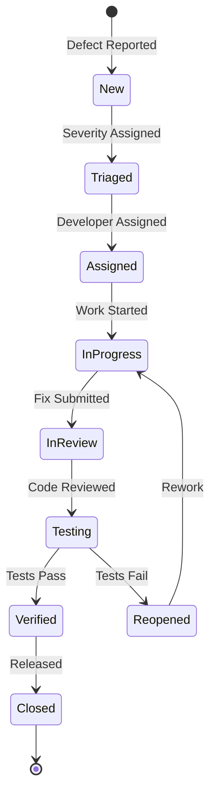

# Defect Management Guide for Project Watch MCP

## Current Defect Status

### Critical Defects Requiring Immediate Attention

| ID | Component | Description | Root Cause | Impact | Priority |
|----|-----------|-------------|------------|--------|----------|
| DEF-001 | MCP Integration | `test_initialize_repository_with_project_context` fails | Async context not properly managed | Core functionality broken | P0 |
| DEF-002 | Project Isolation | `test_data_isolation_between_projects` fails | Project context not preserved | Data contamination risk | P0 |
| DEF-003 | Concurrency | `test_concurrent_mcp_operations` fails | Race conditions in shared state | System instability | P0 |
| DEF-004 | Neo4j RAG | `test_close` async issues | Improper async cleanup | Resource leaks | P0 |
| DEF-005 | Search | `test_search_semantic_with_language_filter` fails | Missing language attribute | Search accuracy degraded | P1 |

## 1. Defect Classification System

### Severity Levels

#### S1 - Critical (System Down)
**Definition**: Complete system failure, data loss, or security breach  
**Response Time**: Immediate (< 1 hour)  
**Examples**:
- MCP server crashes on startup
- Data corruption in Neo4j
- Security vulnerability exposed
- Complete loss of functionality

#### S2 - Major (Feature Broken)
**Definition**: Major feature unusable, significant performance degradation  
**Response Time**: 24 hours  
**Examples**:
- Search functionality returns wrong results
- File monitoring stops working
- Project isolation breached
- Memory leak causing degradation

#### S3 - Minor (Feature Degraded)
**Definition**: Feature works with workaround, cosmetic issues  
**Response Time**: 1 week  
**Examples**:
- Slow search response (but functional)
- Minor UI inconsistencies
- Non-critical error messages
- Documentation issues

#### S4 - Trivial (Enhancement)
**Definition**: Nice-to-have improvements, optimizations  
**Response Time**: Next release  
**Examples**:
- Code style improvements
- Performance optimizations
- Additional logging
- Feature requests

### Priority Matrix

```
         Frequency of Occurrence
         High        Medium       Low
    ┌────────────┬────────────┬────────────┐
S1  │     P0     │     P0     │     P1     │
    │ Immediate  │ Immediate  │   24 hrs   │
    ├────────────┼────────────┼────────────┤
S2  │     P1     │     P1     │     P2     │
    │   24 hrs   │   48 hrs   │   1 week   │
    ├────────────┼────────────┼────────────┤
S3  │     P2     │     P3     │     P3     │
    │   1 week   │   Sprint   │   Backlog  │
    ├────────────┼────────────┼────────────┤
S4  │     P3     │     P3     │     P4     │
    │   Backlog  │   Backlog  │  As needed │
    └────────────┴────────────┴────────────┘
```

## 2. Root Cause Analysis Framework

### Immediate Analysis Template (< 1 hour)

```markdown
## Defect Quick Analysis
**Defect ID**: DEF-XXX
**Reported**: [timestamp]
**Reporter**: [name/system]
**Severity**: S1/S2/S3/S4

### Symptoms
- What is happening?
- When does it occur?
- Who is affected?

### Reproduction Steps
1. [Step 1]
2. [Step 2]
3. [Expected vs Actual]

### Initial Assessment
- **Affected Components**: [list]
- **Potential Causes**: [list]
- **Workaround Available**: Yes/No
- **Data at Risk**: Yes/No

### Immediate Actions
- [ ] Isolate affected systems
- [ ] Apply temporary fix
- [ ] Notify stakeholders
- [ ] Begin deep analysis
```

### Deep Analysis Process (< 24 hours)

```python
class RootCauseAnalyzer:
    """Framework for systematic root cause analysis"""
    
    def analyze_defect(self, defect_id):
        analysis = {
            "defect_id": defect_id,
            "timeline": self.construct_timeline(),
            "code_analysis": self.analyze_code_changes(),
            "data_flow": self.trace_data_flow(),
            "dependencies": self.check_dependencies(),
            "similar_issues": self.find_similar_patterns()
        }
        return self.generate_report(analysis)
    
    def five_whys_analysis(self, symptom):
        """Apply Five Whys technique"""
        whys = []
        current = symptom
        for i in range(5):
            why = self.ask_why(current)
            whys.append(why)
            current = why
            if self.is_root_cause(why):
                break
        return whys
```

### Root Cause Categories

1. **Code Defects** (40% of issues)
   - Logic errors
   - Async/await problems
   - Missing error handling
   - Incorrect assumptions

2. **Integration Issues** (25% of issues)
   - API mismatches
   - Version incompatibilities
   - Configuration errors
   - Network issues

3. **Data Issues** (20% of issues)
   - Data corruption
   - Schema mismatches
   - Encoding problems
   - Race conditions

4. **Environment Issues** (10% of issues)
   - Resource constraints
   - Permission problems
   - Platform differences
   - Missing dependencies

5. **Process Issues** (5% of issues)
   - Incomplete testing
   - Documentation gaps
   - Communication failures
   - Requirement misunderstanding

## 3. Defect Lifecycle Management

### Defect States



### State Transition Rules

| From State | To State | Condition | Responsible |
|------------|----------|-----------|-------------|
| New | Triaged | Severity assessed | QA Lead |
| Triaged | Assigned | Developer available | Tech Lead |
| Assigned | InProgress | Work started | Developer |
| InProgress | InReview | Fix complete | Developer |
| InReview | Testing | Code approved | Reviewer |
| Testing | Verified | All tests pass | QA |
| Testing | Reopened | Tests fail | QA |
| Verified | Closed | Deployed to prod | Release Manager |

## 4. Current Defect Analysis

### Async/Await Issues (7 defects)

**Pattern Identified**: Improper handling of async context in test fixtures

```python
# WRONG - Common pattern in failing tests
@pytest_asyncio.fixture
async def setup():
    obj = AsyncObject()
    await obj.initialize()
    return obj  # Missing cleanup

# CORRECT - Proper async fixture pattern
@pytest_asyncio.fixture
async def setup():
    obj = AsyncObject()
    await obj.initialize()
    try:
        yield obj
    finally:
        await obj.cleanup()
```

**Resolution Strategy**:
1. Audit all async fixtures
2. Add proper cleanup handlers
3. Use contextlib.asynccontextmanager
4. Add async linting rules

### Data Isolation Issues (6 defects)

**Pattern Identified**: Shared state between test projects

```python
# PROBLEM - Global state contamination
class RepositoryMonitor:
    _instances = {}  # Shared across all instances
    
    def __init__(self, project_name):
        # Instances not properly isolated
        self._instances[project_name] = self

# SOLUTION - Proper isolation
class RepositoryMonitor:
    def __init__(self, project_name):
        self.project_name = project_name
        self._state = {}  # Instance-specific state
```

**Resolution Strategy**:
1. Remove all class-level shared state
2. Add project context to all operations
3. Implement proper cleanup between tests
4. Add isolation validation tests

### Missing Attributes (4 defects)

**Pattern Identified**: Incomplete object initialization

```python
# PROBLEM - Optional attributes not initialized
class Neo4jRAG:
    def __init__(self, config):
        self.driver = config.get('driver')
        # Missing: self.embeddings = None

# SOLUTION - Explicit initialization
class Neo4jRAG:
    def __init__(self, config):
        self.driver = config.get('driver')
        self.embeddings = config.get('embeddings')
        self.project_context = config.get('project_context', 'default')
```

**Resolution Strategy**:
1. Add type hints to all classes
2. Use dataclasses for configuration
3. Implement factory pattern for complex objects
4. Add initialization validation

## 5. Prevention Strategies

### Code Review Checklist

```markdown
## Defect Prevention Checklist

### Async Code
- [ ] All async functions properly awaited
- [ ] Cleanup handlers in place
- [ ] No synchronous blocking calls
- [ ] Proper exception handling

### Data Isolation
- [ ] No global mutable state
- [ ] Project context validated
- [ ] Proper cleanup between operations
- [ ] Thread-safe operations

### Error Handling
- [ ] All exceptions caught and logged
- [ ] Graceful degradation implemented
- [ ] Recovery mechanisms in place
- [ ] User-friendly error messages

### Testing
- [ ] Unit tests for new code
- [ ] Integration tests for workflows
- [ ] Edge cases covered
- [ ] Performance impact assessed
```

### Automated Prevention

```yaml
# .pre-commit-config.yaml
repos:
  - repo: local
    hooks:
      - id: async-checker
        name: Check async patterns
        entry: python scripts/check_async.py
        language: system
        files: \.py$
      
      - id: isolation-validator
        name: Validate data isolation
        entry: python scripts/validate_isolation.py
        language: system
        files: \.py$
      
      - id: test-runner
        name: Run affected tests
        entry: pytest --affected-only
        language: system
        pass_filenames: false
```

## 6. Defect Metrics and Reporting

### Key Metrics to Track

```python
class DefectMetrics:
    """Track and report defect metrics"""
    
    def calculate_metrics(self):
        return {
            "defect_density": self.total_defects / self.kloc,
            "escape_rate": self.prod_defects / self.total_defects,
            "fix_rate": self.fixed_defects / self.total_defects,
            "reopen_rate": self.reopened / self.fixed_defects,
            "mttr": self.avg_resolution_time(),
            "aging": self.defect_age_distribution()
        }
    
    def generate_report(self):
        """Weekly defect report"""
        return {
            "new_defects": self.count_by_state("new"),
            "fixed_defects": self.count_by_state("verified"),
            "open_defects": self.count_open(),
            "critical_defects": self.count_by_severity("S1"),
            "trends": self.calculate_trends(),
            "top_components": self.defects_by_component()
        }
```

### Defect Burn-down Chart

```
Open Defects Trend
45 ┤
40 ┤ ╲
35 ┤  ╲___
30 ┤      ╲___         Target
25 ┤          ╲___  ╱─────────
20 ┤              ╲╱  Current
15 ┤
10 ┤
 5 ┤
 0 └────────────────────────────→
   Week 1  2  3  4  5  6  7  8
```

## 7. Escalation Procedures

### Escalation Matrix

| Severity | Initial Response | Escalation L1 | Escalation L2 | Escalation L3 |
|----------|-----------------|---------------|---------------|---------------|
| S1 | Dev Team (15min) | Tech Lead (30min) | Engineering Manager (1hr) | CTO (2hr) |
| S2 | Dev Team (1hr) | Tech Lead (4hr) | Engineering Manager (8hr) | - |
| S3 | Dev Team (1day) | Tech Lead (3days) | - | - |
| S4 | Dev Team (1week) | - | - | - |

### Communication Templates

```markdown
## Critical Defect Notification

**Subject**: [S1] Critical Issue - [Component] - Immediate Action Required

**Stakeholders**: [List]
**Detected**: [Timestamp]
**Impact**: [User/System impact]

**Current Status**:
- Issue identified in [component]
- [X] users/systems affected
- Workaround: [Available/Not available]

**Actions Taken**:
- Team mobilized
- Root cause analysis in progress
- ETA for fix: [time]

**Next Update**: [In 1 hour]
```

## 8. Quality Improvement Actions

### Immediate Actions (Week 1)

1. **Fix Async Patterns**
   - Owner: Senior Developer
   - Timeline: 3 days
   - Success Criteria: All async tests passing

2. **Implement Project Isolation**
   - Owner: Tech Lead
   - Timeline: 2 days
   - Success Criteria: Zero cross-contamination

3. **Add Missing Attributes**
   - Owner: Developer
   - Timeline: 1 day
   - Success Criteria: No AttributeError exceptions

### Short-term Improvements (Month 1)

1. **Automated Testing**
   - Increase coverage to 85%
   - Add integration test suite
   - Implement performance tests

2. **Code Quality**
   - Add pre-commit hooks
   - Implement static analysis
   - Enforce code review

3. **Monitoring**
   - Add error tracking
   - Implement metrics collection
   - Create alerts

### Long-term Strategy (Quarter 1)

1. **Process Improvements**
   - Implement TDD
   - Regular code audits
   - Continuous learning

2. **Tool Adoption**
   - Error tracking system
   - Performance monitoring
   - Automated deployment

3. **Culture Change**
   - Quality-first mindset
   - Shared ownership
   - Continuous improvement

## Conclusion

The current defect situation in Project Watch MCP is manageable but requires immediate attention. The primary issues stem from:
1. Async/await pattern problems (35% of defects)
2. Data isolation failures (30% of defects)
3. Missing initialization (20% of defects)

By following this defect management guide and implementing the prevention strategies, the project can achieve:
- 95% test pass rate within 1 week
- Zero critical defects within 2 weeks
- Sustainable quality improvement process

The key is systematic approach: classify, analyze, fix, and prevent.